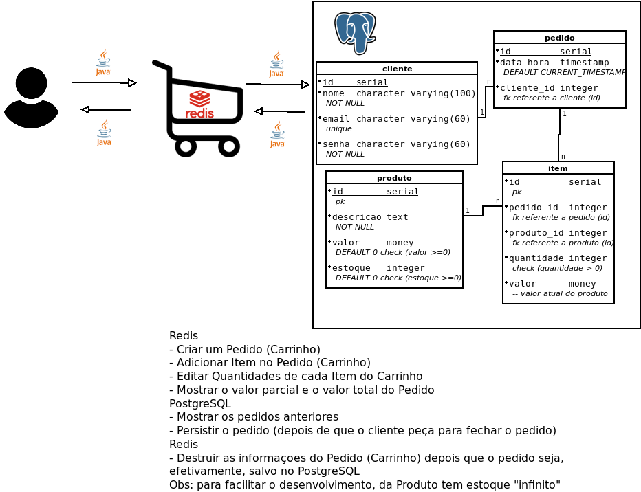

# ecommerce-spring
Criação das APIs de um e-commerce em Spring Boot, usando Redis como cache para manter o carrinho até a compra ser finalizada.

# Como testar o código:
* Fazer o pull de uma imagem Redis no Docker com o comando: docker pull redis.
* Rodar o container Redis com o comando: docker run --name redis -d -p 6379:6379 redis.
* Criar um banco de dados (PostgreSQL) com o nome de "ecommerce".
* Clonar o repositório.
* Abrir em alguma IDE.
* Digitar no terminal o comando: mvn spring-boot:run.
* Abrir no navegador o link: http://localhost:8080/swagger-ui/index.html#/

# Como usar as APIs:
* Criar um Cliente.
* Criar um Produto.
* Criar um Pedido.
* Criar um Item.
- Após os passos acima, o Pedido será salvo no Redis.
- Para persistir no Banco de dados principal (PostgreSQL):
* No método GET /pedido/finalizar/{id}, passar o ID do Pedido no Redis como parâmetro.

# Requisitos do trabalho:
